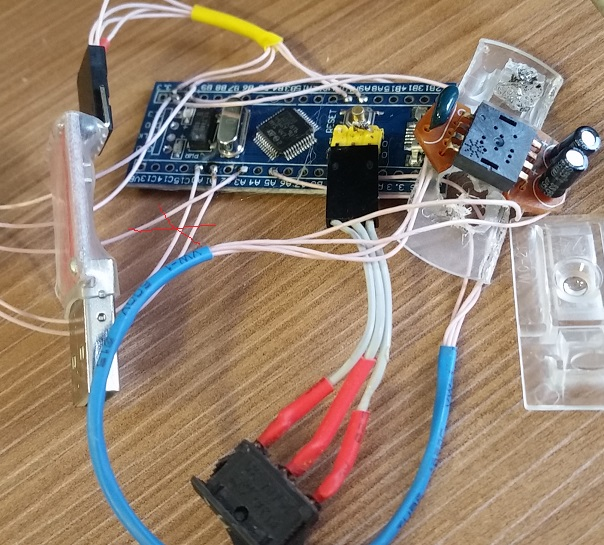
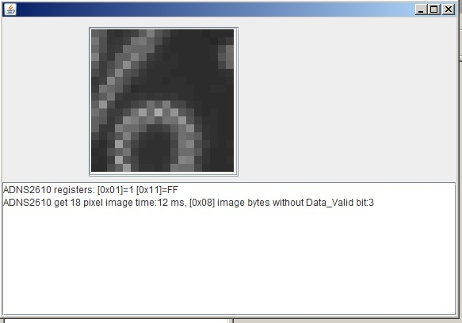

	STM32F103C8T6+ADNS2610 -> java application.

ShowADNS2610 - the Java sample source code for an ADNS2610 "video" show (IDE NetBeans)

ADNS2610_sample - Windows gcc for stm32F103: 
 1. download https://drive.google.com/open?id=0B3hH5_ZXlbvwS000U0dhZnl2cGc
 2. unzip in any place 
 3. "./make.cmd D:\xxx\watering_ctrl all"

                                                
                                                
                                             
